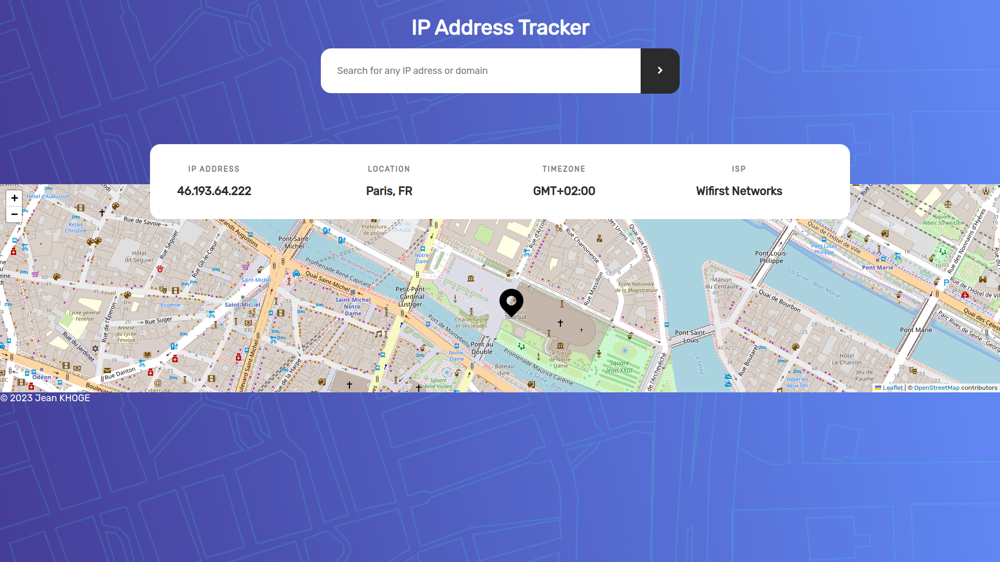

# IP Address Tracker

IP Address Tracker is a web application that allows users to explore the geographical locations of IP addresses and domains. It integrates the IP Geolocation API by IPify and the LeafletJS library to provide an interactive and informative experience.



## Table of Contents

- [Features](#features)
- [Getting Started](#getting-started)
  - [Prerequisites](#prerequisites)
  - [Installation](#installation)
- [Usage](#usage)
- [Technologies](#technologies)

## Features

- **User Location Detection:** On the initial page load, the app automatically detects and displays the user's IP address and location on an interactive map.

- **IP/Domain Search:** Users can search for any IP address or domain to retrieve detailed location information, including city, region, country, zip code, and coordinates.

- **Interactive Map:** The app utilizes LeafletJS to create an interactive map with markers and tooltips, making it easy to explore IP address locations.

- **Responsive Design:** The app is designed to provide a consistent and user-friendly experience across various screen sizes and devices.

## Getting Started

### Prerequisites

To run this project, you need to have the following software installed on your machine:

- [Node.js](https://nodejs.org/) (with npm)

### Installation

1. Clone the repository:

   ```bash
   git clone https://github.com/jeankh/ip-address-tracker.git
   ```

2. Navigate to the project directory:

   ```bash
       cd ip-address-tracker
   ```

3. Install dependencies:
   ```bash
       npm install
   ```

### Installation

1. Start the development server:

   ```bash
       npm start
   ```

2. Open your web browser and go to http://localhost:3000 to access the IP Address Tracker app.

3. Use the search bar to enter an IP address or domain and explore its location on the map.

### Technologies

- ReactJS
- LeafletJS
- IP Geolocation API by IPify
- HTML/CSS
